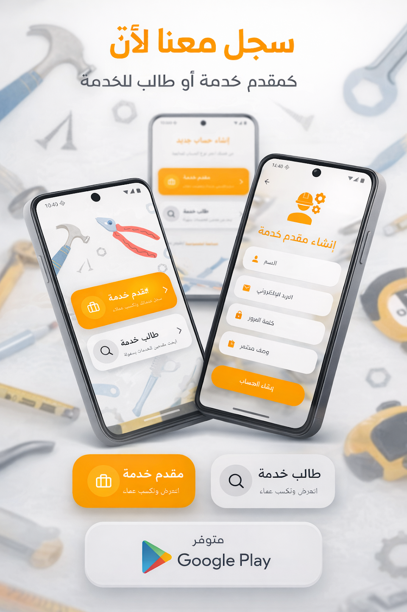
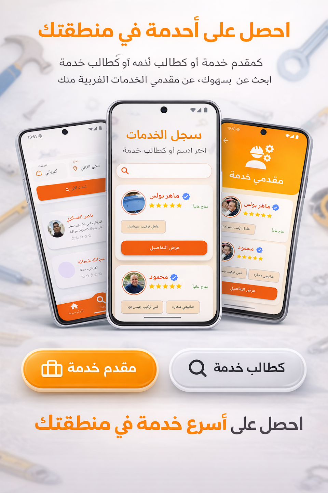
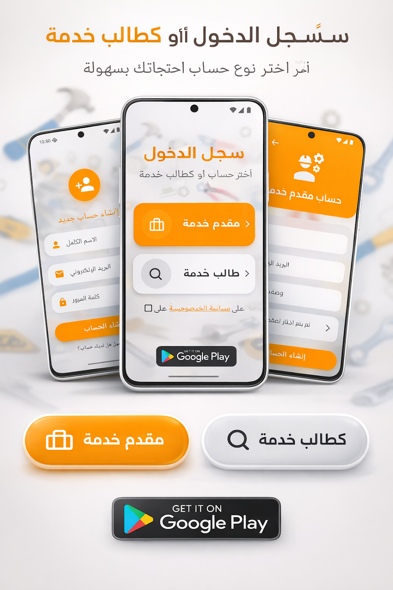

  

<h1 align="center">🛡️ KHADAMAT EL-HAI | النخبة لخدمات الحي</h1>

  <i align="center">"Engineering Solutions, Not Just Apps. Redefining the Neighborhood Service Paradigm."</i>

  
  
  

---

## 🏛️ Executive Summary | البيان التنفيذي
**Khadamat El-Hai** is a proprietary, high-availability service ecosystem. It is engineered for extreme scalability and military-grade reliability. This repository serves as a **Strategic Showcase** for the UI/UX Interface and System Architecture. 

> [!IMPORTANT]
> **Proprietary Source Code Notice:** To maintain market advantage and intellectual integrity, the core engine, backend logic, and smart-matching algorithms are **Strictly Confidential (Private)**. Access is restricted to authorized stakeholders only.

---

## 💎 The Visual Masterpiece (UI/UX Showcase)

  <table align="center" style="border: none; background: transparent;">
    <tr>
      <td style="border: none;"></td>
      <td style="border: none;"></td>
      <td style="border: none;"></td>
    </tr>
    <tr align="center">
      <td style="border: none;"><b>System Hub</b></td>
      <td style="border: none;"><b>Elite Profiles</b></td>
      <td style="border: none;"><b>Encrypted Chat</b></td>
    </tr>
  </table>

---

## ⚡ Engineering Excellence | التميز الهندسي
The underlying infrastructure of **Khadamat El-Hai** follows the **Industry-Leading Standards**:

* **🛡️ High-Security Core:** Robust Firebase integration with custom security rules for total data isolation.
* **⚙️ Scalable Architecture:** Modular "Clean" implementation, ensuring 99.9% uptime and zero-latency performance.
* **🎨 Precision UI:** Hand-crafted Dart widgets designed for a frictionless user journey and maximum conversion.
* **📡 Real-time Engine:** Custom-built synchronization for instant provider-to-customer handshakes.

---

## 🌐 Market Presence
The production version is live and serving real-world requests. Join the revolution:

  

---

## 👤 The Architect | المطور
**Osama Islam (ElDeep)**
*Principal Mobile Engineer | Flutter Specialist*

"I don't just write code; I build digital legacies."

  

---

  © 2026 Osama ElDeep Solutions. All Intellectual Property Rights Reserved.   <i>Secure. Scalable. Superior.</i>

